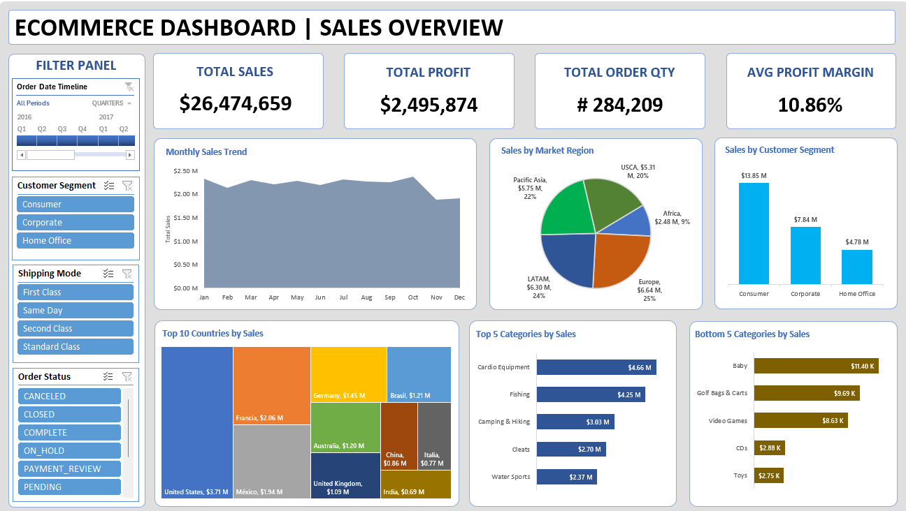

# 📊 Ecommerce Data Analysis Dashboard

<div align="center">
  


**An interactive Excel dashboard for comprehensive ecommerce data analysis and visualization**

</div>

---

## 🎯 Project Overview

This project presents a sophisticated, interactive Excel dashboard designed to analyze and visualize ecommerce data comprehensively. The dashboard transforms raw business data into actionable insights, enabling stakeholders to make informed, data-driven decisions across sales, marketing, and operations.

## ✨ Key Features

### 📈 **Sales Analytics**
- Real-time sales performance tracking
- Revenue trend analysis with time-series visualization
- Order volume monitoring and forecasting

### 👥 **Customer Intelligence**
- Advanced customer segmentation analysis
- Repeat purchase behavior insights
- Geographic distribution mapping
- Customer lifetime value calculations

### 🛍️ **Product Performance**
- Top-selling products identification
- Category-wise performance analysis
- Inventory turnover metrics
- Product profitability analysis

### 🎛️ **Interactive Controls**
- Dynamic slicers for multi-dimensional filtering
- Date range selectors for temporal analysis
- Regional and categorical dropdown filters
- Real-time dashboard updates

### 📊 **Rich Visualizations**
- Comprehensive KPI scorecards
- Interactive charts and graphs
- Heat maps for performance visualization
- Trend indicators and variance analysis

## 📁 Project Structure

```
├── 📊 Ecommerce Data Analysis Dashboard.xlsx    # Main dashboard file
├── 🖼️ Dashboard.png                            # Dashboard preview
└── 📖 README.md                                # Project documentation
```

## 🚀 Getting Started

### Prerequisites
- **Microsoft Excel 2016** or later (recommended: Excel 365)
- Basic understanding of Excel navigation

### Installation & Usage
1. **Download** the `Ecommerce Data Analysis Dashboard.xlsx` file
2. **Open** the file in Microsoft Excel
3. **Enable macros** if prompted (for enhanced functionality)
4. **Navigate** through different worksheet tabs
5. **Interact** with filters and slicers to explore data insights
6. **Reference** the `Dashboard.png` for layout overview

## 🖼️ Dashboard Preview



*Interactive dashboard showcasing comprehensive ecommerce analytics*

## 🛠️ Technical Requirements

| Requirement | Minimum | Recommended |
|-------------|---------|-------------|
| **Software** | Excel 2016 | Excel 365 |
| **RAM** | 4GB | 8GB+ |
| **Storage** | 50MB | 100MB |
| **Features** | Basic Excel | Power Query, Pivot Tables |

## 👨‍💻 Author Information

<div align="center">

### **Pavan Eleti**
*Data Analyst & Dashboard Developer*

[](mailto:pavaneletisj@gmail.com)
[](https://github.com/PAVANKUMARELETI/Ecommerce-Data-Analysis-Dashboard-Using-Excel)
[](#)

**Contact:** pavaneletisj@gmail.com  
**Repository:** [Ecommerce Data Analysis Dashboard](https://github.com/PAVANKUMARELETI/Ecommerce-Data-Analysis-Dashboard-Using-Excel)

</div>

## 🤝 Contributing

Contributions, issues, and feature requests are welcome! Feel free to check the [issues page](https://github.com/PAVANKUMARELETI/Ecommerce-Data-Analysis-Dashboard-Using-Excel/issues).

## 📄 License

This project is licensed for **educational and personal use**. For commercial applications or redistribution, please contact the author.

---

<div align="center">

**⭐ If you found this project helpful, please consider giving it a star!**

*Made with ❤️ and Excel*

</div>
